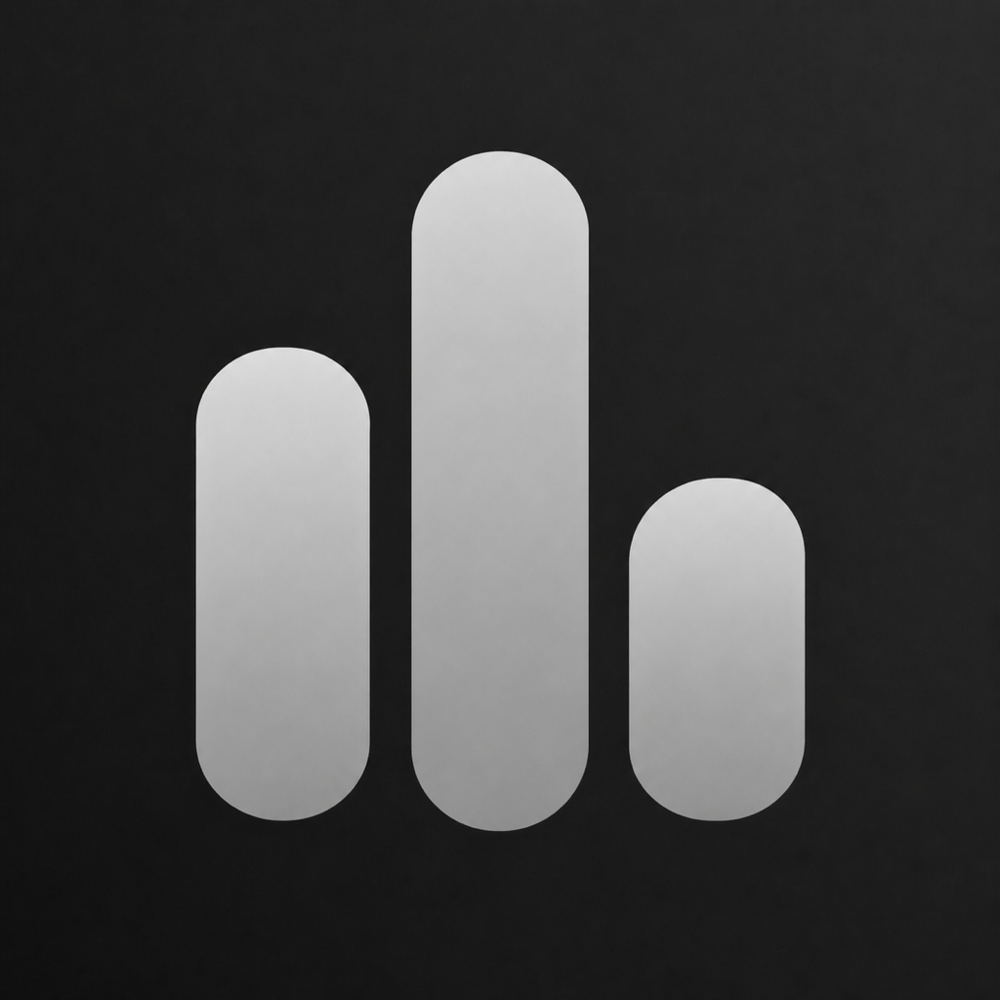

<p align="center">
  
</p>

<h1 align="center">Core Metrics</h1>

<p align="center">
  A lightweight, private macOS menu-bar utility for CPU, memory, and startup-disk usage.
</p>

Core Metrics is a native SwiftUI app that keeps a small set of useful aggregate system metrics visible without becoming an optimizer or an Activity Monitor replacement. It has no account, network service, telemetry, analytics, advertising, or third-party dependency.

> [!NOTE]
> Core Metrics is under active development and does not yet have a downloadable release. The project currently requires macOS 27 and Xcode 27.

## Highlights

- **Native macOS panel:** The system-presented `MenuBarExtra` window supplies current Liquid Glass while keeping all selection controls open for repeated changes.
- **Customizable status item:** Choose up to seven stats. They always follow the panel's CPU → Memory → Storage order, and one-decimal values with full unit abbreviations use fixed eight-character columns inside a fixed-width status item to prevent width jitter.
- **Focused system values:** Choose aggregate CPU utilization and breakdowns, Activity Monitor-style memory totals and categories, or startup-disk capacity and percentages—without charts or duplicated live values in the panel.
- **Local and private:** Samples stay on the Mac, no metric history is retained, and nothing is transmitted or persisted as telemetry.
- **Graceful failure handling:** An unavailable provider clears its current reading, shows a stable placeholder, and retries automatically instead of presenting stale data as live.
- **Mac App Store-oriented:** App Sandbox is enabled, the app uses documented public Apple APIs, and privacy-manifest declarations are kept narrow and truthful.

## Metrics

| Category | Available representations |
| --- | --- |
| CPU | Used, user, system, and idle percentages |
| Memory | Memory Used, used percentage, Wired Memory, Compressed Memory, Cached Files, Swap Used, and Physical Memory |
| Storage | Used space, used percentage, free space, and total capacity for the startup volume |

The exact formulas and storage semantics are documented in [docs/METRICS.md](docs/METRICS.md).

## Requirements

- macOS 27 or later
- Xcode 27 or later

The current development baseline is Xcode 27.0 beta (`27A5252f`) with Apple Swift 6.4. A future App Store archive must be produced with a stable Xcode version accepted by App Store Connect.

## Build

Clone the repository and open `Core Metrics.xcodeproj`, or build without signing from Terminal:

```sh
git clone <repository-url>
cd core-metrics
xcodebuild -list -project "Core Metrics.xcodeproj"
xcodebuild \
  -project "Core Metrics.xcodeproj" \
  -scheme "Core Metrics" \
  -destination 'platform=macOS' \
  CODE_SIGNING_ALLOWED=NO \
  build
```

After launching, Core Metrics appears only in the menu bar. Use the persistent panel and **Settings…** to change the status-item layout.

## Test

Run the repeatable unit suite without code signing:

```sh
xcodebuild \
  -project "Core Metrics.xcodeproj" \
  -scheme "Core Metrics" \
  -destination 'platform=macOS' \
  CODE_SIGNING_ALLOWED=NO \
  test
```

The separate `Core Metrics UI Tests` scheme covers status-item launch and persistent-panel interaction. UI tests require a signed local build and an interactive macOS session with working automation permissions.

## Architecture

The app separates system acquisition, pure calculation, sampling, preferences, and SwiftUI presentation:

```text
Documented Apple APIs
        ↓
Metric providers
        ↓
Pure calculations and snapshots
        ↓
MetricsStore current snapshots
        ↓
Menu bar · Persistent status panel · Settings
```

Additional documentation:

- [Architecture](docs/ARCHITECTURE.md)
- [Design principles](docs/DESIGN.md)
- [Architecture decisions](docs/DECISIONS.md)
- [Metric definitions](docs/METRICS.md)
- [App Store readiness](docs/APP_STORE.md)
- [Icon provenance](docs/ICON.md)

## Privacy

Core Metrics reads aggregate CPU counters, aggregate virtual-memory and swap counters, and startup-volume capacity locally. It does not inspect arbitrary processes or files, make network requests, retain metric history, or collect personal data.

Only menu-bar preferences are stored in `UserDefaults`. The privacy manifest declares no tracking or collected data. See [docs/APP_STORE.md](docs/APP_STORE.md) for the current privacy and release audit.

## Scope

Core Metrics intentionally excludes process inspection, temperature probing, fan control, SMC or private APIs, privileged helpers, cleaning, file scanning, malware features, hardware tuning, battery/network monitoring, accounts, cloud services, analytics, ads, subscriptions, and purchases.

## Contributing

Issues and focused pull requests are welcome. Please read [CONTRIBUTING.md](CONTRIBUTING.md) and keep proposals within the product scope above.

## License

No license has been selected yet. The source is publicly visible, but no permission to copy, modify, or redistribute it is granted unless a license is added later.
